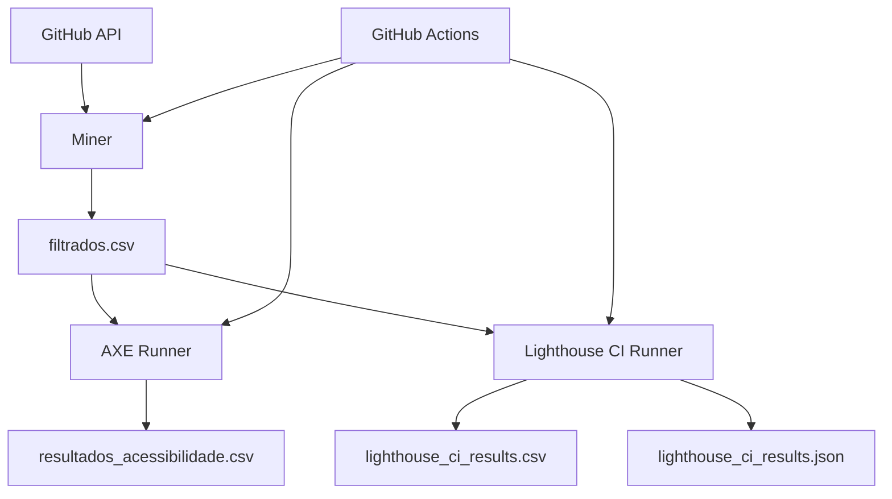

# System Patterns: GitHub Accessibility Analyzer
*Version: 1.0*
*Created: 2025-10-08*
*Last Updated: 2025-10-08*

## Architecture Overview

O sistema segue uma **arquitetura modular em pipeline**, onde cada componente executa uma fase específica do processo de análise:

```
┌─────────────────┐      ┌──────────────────┐      ┌──────────────────┐
│   GitHub API    │ ───> │  Data Filtering  │ ───> │  Accessibility   │
│   Mining        │      │  & Processing    │      │  Testing         │
└─────────────────┘      └──────────────────┘      └──────────────────┘
        │                         │                          │
        ↓                         ↓                          ↓
  repositories.json         filtrados.csv          lighthouse_ci_results.csv
                                                    resultados_acessibilidade.csv
```

### Componentes Principais

1. **GitHub Miner** (`script.js`)
   - Busca repositórios via GraphQL
   - Detecta ferramentas de acessibilidade
   - Filtra bibliotecas vs aplicações

2. **Test Runners**
   - AXE Runner (`run-tests.js`)
   - Lighthouse CI Runner (`lighthouse-ci-runner.js`)

3. **CI/CD Orchestration** (`.github/workflows/`)
   - Automação via GitHub Actions
   - Gestão de timeouts e artefatos

## Key Components

### 1. GitHubAccessibilityMiner (script.js)

**Responsabilidade**: Mineração de repositórios GitHub

**Funcionalidades**:
- Execução de queries GraphQL para buscar repositórios
- Detecção de ferramentas de acessibilidade em múltiplos locais:
  - Arquivos de dependências
  - Arquivos de configuração
  - Workflows CI/CD
  - README e descrição
- Filtragem inteligente de bibliotecas vs aplicações web
- Gestão de rate limits com múltiplos tokens
- Persistência de progresso (processed_repos.json)

**Padrões Utilizados**:
- **Singleton Pattern**: Instância única do miner
- **Strategy Pattern**: Diferentes estratégias de busca por linguagem
- **Circuit Breaker**: Proteção contra rate limits

### 2. AXE Test Runner (run-tests.js)

**Responsabilidade**: Testes de acessibilidade com AXE Core

**Funcionalidades**:
- Execução do AXE Core via Puppeteer
- Classificação de violações por severidade (critical, serious, moderate, minor)
- Classificação por nível WCAG (A, AA, AAA)
- Cálculo de métricas:
  - CER (Coverage of Error Ratio)
  - Taxa de Sucesso de Acessibilidade
- Busca automática de homepage via GitHub API

**Padrões Utilizados**:
- **Template Method**: Estrutura comum para todos os testes
- **Factory Pattern**: Criação de instâncias Puppeteer
- **Observer Pattern**: Logging de progresso

### 3. Lighthouse CI Runner (lighthouse-ci-runner.js)

**Responsabilidade**: Análise de acessibilidade com Lighthouse CI

**Funcionalidades**:
- Execução do Lighthouse CI via CLI
- Foco específico em categoria de acessibilidade
- Classificação de violações por nível WCAG
- Extração de scores de acessibilidade (0-100)
- Geração de relatórios detalhados (CSV + JSON)
- Processamento em batch de múltiplos repositórios

**Padrões Utilizados**:
- **Command Pattern**: Encapsulamento de comandos CLI
- **Repository Pattern**: Acesso a dados via GitHub API
- **Batch Processing**: Processamento em lotes

## Design Patterns in Use

### 1. Token Rotation Strategy

**Problema**: GitHub API tem rate limits de 5000 requisições/hora

**Solução**: Sistema de múltiplos tokens com rotação automática

```javascript
// Padrão implementado em todos os scripts
const tokens = [TOKEN_1, TOKEN_2, TOKEN_3].filter(Boolean);
let tokenIndex = 0;

function nextToken() {
  tokenIndex = (tokenIndex + 1) % tokens.length;
  token = tokens[tokenIndex];
}

function switchTokenIfNeeded(rateLimit) {
  if (rateLimit <= 0) {
    // Encontra próximo token disponível
    // ou aguarda reset
  }
}
```

### 2. Filter Chain Pattern

**Problema**: Separar aplicações web de bibliotecas/ferramentas

**Solução**: Cadeia de filtros sequenciais

```javascript
async isLibraryRepository(repo) {
  // 1. Verifica README
  // 2. Analisa nome e descrição
  // 3. Checa padrões de naming
  // 4. Avalia keywords
  // 5. Decisão final
}
```

### 3. State Persistence Pattern

**Problema**: Perder progresso em caso de interrupção

**Solução**: Persistência incremental em JSON

```javascript
// Salva progresso a cada N repositórios
if (foundRepos.length >= 5) {
  this.appendToCSV(foundRepos);
  this.saveProcessedRepos();
  foundRepos.length = 0;
}
```

### 4. Graceful Degradation

**Problema**: Falhas individuais não devem interromper o batch

**Solução**: Try-catch granular com logging

```javascript
try {
  const analysis = await this.analyzeRepository(repo);
  // processar resultado
} catch (error) {
  console.log(`⚠️ Erro: ${error.message}`);
  this.stats.errors++;
  continue; // Próximo repositório
}
```

## Data Flow

### Fase 1: Mineração

```
GitHub GraphQL API
      │
      ↓
 Search Queries ──> Pagination (cursor-based)
      │
      ↓
Repository Filtering
      │
      ├─> isLibraryRepository()
      ├─> isWebApplication()
      └─> checkRepositoryAbout()
      │
      ↓
Tool Detection
      │
      ├─> checkDependencyFiles()
      ├─> checkConfigFiles()
      └─> checkWorkflows()
      │
      ↓
  CSV Output (filtrados.csv)
```

### Fase 2: Análise AXE

```
filtrados.csv
      │
      ↓
For each repository:
      │
      ├─> getHomepage() via GitHub API
      ├─> Launch Puppeteer
      ├─> Inject AXE Core
      ├─> Run axe.run()
      └─> Classify violations
      │
      ↓
CSV Output (resultados_acessibilidade.csv)
```

### Fase 3: Análise Lighthouse CI

```
filtrados.csv
      │
      ↓
For each repository:
      │
      ├─> getHomepage() via GitHub API
      ├─> Execute @lhci/cli via execSync
      ├─> Read .lighthouseci/*.json
      ├─> Extract accessibility data
      └─> Classify by WCAG level
      │
      ↓
CSV + JSON Output (lighthouse_ci_results.*)
```

## Component Relationships



## Key Technical Decisions

### 1. GraphQL vs REST API

**Decisão**: Usar GraphQL para busca, REST para detalhes

**Rationale**:
- GraphQL permite queries complexas com menos requisições
- REST é melhor para buscar conteúdo de arquivos específicos
- Combinar ambos otimiza o uso de rate limits

### 2. Lighthouse CI vs Lighthouse API

**Decisão**: Usar Lighthouse CI (local)

**Rationale**:
- ✅ 100% gratuito (API tem quota paga)
- ✅ Sem limites de execução
- ✅ Dados permanecem locais
- ✅ Integração fácil com CI/CD
- ❌ Requer mais recursos computacionais

### 3. Puppeteer vs Playwright

**Decisão**: Usar Puppeteer para AXE

**Rationale**:
- AXE Core tem integração nativa com Puppeteer
- Mais maduro e estável
- Melhor documentação para casos de uso de acessibilidade
- Menor overhead

### 4. CSV vs Banco de Dados

**Decisão**: Usar CSV como formato principal

**Rationale**:
- Simplicidade para análise estatística (R, Python, Excel)
- Fácil versionamento no Git
- Não requer infraestrutura adicional
- Ideal para datasets acadêmicos
- JSON usado para detalhes completos

### 5. Filtragem por README

**Decisão**: Buscar e analisar README de todos os repos

**Rationale**:
- Reduz falsos positivos (bibliotecas mascaradas como apps)
- Melhora precisão da classificação
- Identifica GUIs e demos
- Trade-off: mais requisições API, mas melhor qualidade

### 6. Batch Processing com Timeout

**Decisão**: Timeout de 6 horas no GitHub Actions

**Rationale**:
- Permite processar centenas de repositórios
- GitHub Actions tem limite de 6h/job
- Sistema de checkpoint evita perda de progresso
- Pode ser executado múltiplas vezes sequencialmente

## Error Handling Strategy

### Níveis de Erro

1. **Warning** (⚠️): Log e continua
   - Arquivo não encontrado
   - README vazio
   - Homepage inválida

2. **Error** (❌): Log, incrementa contador, continua
   - Falha em teste individual
   - Timeout de rede
   - Resposta inválida da API

3. **Fatal** (💥): Interrompe execução
   - Token inválido
   - Arquivo CSV de entrada não encontrado
   - Erro de sistema

### Recovery Mechanisms

- **Rate Limit**: Espera automática até reset
- **Token Rotation**: Troca para próximo token disponível
- **State Persistence**: Salva progresso a cada 5 repositórios
- **Resume Capability**: Usa processed_repos.json para continuar

---

*Este documento captura a arquitetura do sistema e os padrões de design utilizados no projeto.*

